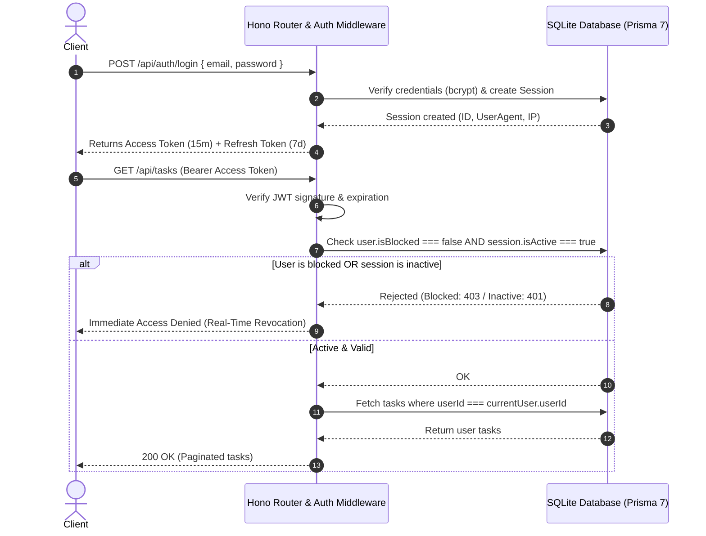

# ⚡ Hono + Prisma 7 (SQLite) Production REST API Starter Template

[](https://github.com/Collanteslu/hono-prisma-production-starter/actions)
[](https://opensource.org/licenses/MIT)
[](https://hono.dev/)
[](https://www.prisma.io/)
[](https://www.typescriptlang.org/)
[](https://scalar.com/)

> **A production-ready, batteries-included REST API GitHub template** built with **TypeScript**, **[Hono](https://hono.dev/)**, **[Prisma 7](https://www.prisma.io/)** (embedded SQLite via LibSQL Driver Adapter), **[Zod](https://zod.dev/)**, **Bcrypt**, **Stateful Sessions with real-time revocation and user blocking**, **Rate Limiting**, **Graceful Shutdown**, **Docker containerization**, and interactive **[Scalar OpenAPI](https://scalar.com/)** documentation.

---

## 🎯 Why Use This Template?

Starting a backend project often requires reimplementing the same boilerplate: authentication, password hashing, session revocation, input validation, rate limiting, and database models.

This template gives you an **opinionated, robust, production-grade foundation**:
- **Zero External Dependencies to Run**: Uses embedded SQLite with Prisma 7 Driver Adapters. Anyone can clone and run it instantly without configuring Docker, PostgreSQL, or Redis.
- **Enterprise-Grade Authentication**: Access Tokens (15 min) + Refresh Tokens (7 days) with **Token Rotation** and **Stateful Session tracking** in SQLite.
- **Instant Revocation & Real-Time Suspension**: Suspend accounts or revoke active sessions immediately; requests are rejected in real-time without waiting for JWT expiration.
- **Strict User Ownership**: Standard users can only interact with tasks they own.
- **OpenAPI 3.0 & Swagger/Scalar Included**: Interactive web documentation served out-of-the-box at `/docs`.
- **Git-Integrated API Testing**: Full collection included for **[Bruno API Client](https://www.usebruno.com/)** with automated token propagation.

---

## 📑 Table of Contents
1. [Architecture & Project Structure](#-architecture--project-structure)
2. [Quickstart (3 Steps)](#-quickstart-in-3-steps)
3. [Using as a GitHub Template](#-using-as-a-github-template)
4. [Interactive API Documentation (Scalar)](#-interactive-api-documentation-scalar)
5. [Testing with Bruno API Client](#-testing-with-bruno-api-client)
6. [Stateful Sessions & Security Model](#-stateful-sessions--security-model)
7. [Endpoints Reference](#-endpoints-reference)
8. [Automated Test Suite](#-automated-test-suite)
9. [Docker Deployment](#-docker-deployment)
10. [Contributing & Development Guidelines](#-contributing--development-guidelines)
11. [License](#-license)

---

## 🏗️ Architecture & Project Structure

```text
hono-prisma-production-starter/
├── .env                              # Local environment variables
├── .env.example                      # Production environment template
├── .github/
│   ├── workflows/ci.yml              # GitHub Actions CI (Typechecking & Build)
│   ├── ISSUE_TEMPLATE/               # Bug report & feature request forms
│   └── PULL_REQUEST_TEMPLATE.md      # Standard PR checklist
├── prisma.config.ts                  # Prisma 7 configuration file
├── prisma/
│   └── schema.prisma                 # Domain models: User, Session, RefreshToken, Task
├── bruno/                            # Complete collection for Bruno API Client
│   ├── bruno.json                    # Bruno collection metadata
│   ├── collection.bru                # Global Authorization Bearer header
│   ├── environments/Local.bru        # Local environment variables (baseUrl, token)
│   ├── Auth/                         # Login Admin, Login User, Refresh, Logout
│   ├── Sessions/                     # List sessions, Revoke session, Revoke all
│   ├── Users/                        # Paginated user CRUD, Block / Unblock user
│   └── Tasks/                        # Paginated & filtered task CRUD
├── src/
│   ├── config/
│   │   └── env.ts                    # Zod-validated environment variables
│   ├── db.ts                         # Prisma 7 client & automatic seeder
│   ├── docs/
│   │   └── openapi.ts                # Complete OpenAPI 3.0 specification
│   ├── jobs/
│   │   └── cleanup.ts                # Background routine purging expired sessions
│   ├── middleware/
│   │   ├── auth.ts                   # Stateful session & real-time block check
│   │   ├── rateLimit.ts              # IP-based rate limiter middleware
│   │   └── requestId.ts              # Tracing header (X-Request-Id)
│   ├── routes/
│   │   ├── auth.ts                   # /api/auth routes
│   │   ├── sessions.ts               # /api/sessions routes
│   │   ├── users.ts                  # /api/users routes
│   │   └── tasks.ts                  # /api/tasks routes
│   ├── schemas/
│   │   └── index.ts                  # Zod schemas for bodies and query parameters
│   ├── types/
│   │   └── index.ts                  # TypeScript interfaces and Hono AppEnv
│   ├── utils/
│   │   └── password.ts               # Bcrypt password hashing utilities
│   └── index.ts                      # Main entrypoint, global middlewares & shutdown
├── test-api.sh                       # End-to-end bash test suite
├── Dockerfile                        # Multi-stage production container
├── docker-compose.yml                # Production Compose configuration
└── LICENSE                           # MIT License
```

---

## ⚡ Quickstart in 3 Steps

### Prerequisites
- **Node.js** v18.14.0 or higher (Tested on Node v20 & v24)
- **npm** v9 or higher

```bash
# 1. Clone or generate your repository
git clone https://github.com/your-username/your-repo-name.git
cd your-repo-name

# 2. Install dependencies & initialize SQLite database
npm install
npx prisma db push

# 3. Start development server with hot-reload
npm run dev
```

The API will be running on:
```text
http://localhost:3011
```

*(On first startup, default demo accounts and tasks are automatically seeded into SQLite with bcrypt-hashed passwords).*

---

## 📋 Using as a GitHub Template

1. Click the green **"Use this template"** button at the top of the repository in GitHub.
2. Choose **"Create a new repository"**.
3. Name your repository and clone it to your local machine.
4. Update `package.json` with your project's name and details.
5. You now have a complete, secure API architecture ready to build features upon.

---

## 📖 Interactive API Documentation (Scalar)

The API ships with an interactive, modern web console powered by **[Scalar](https://scalar.com/)**:

- **Interactive API Console:** [http://localhost:3011/docs](http://localhost:3011/docs)
- **OpenAPI 3.0 JSON Spec:** [http://localhost:3011/openapi.json](http://localhost:3011/openapi.json)

You can explore endpoints, inspect request and response schemas, and execute live HTTP calls with Bearer Token authorization directly from your browser.

---

## 🐶 Testing with Bruno API Client

### What is Bruno?
**[Bruno](https://www.usebruno.com/)** is an open-source, lightweight, fast API client built as a modern, offline-first alternative to Postman and Insomnia.
- **Git-Friendly**: Collections are stored as human-readable `.bru` plain-text files inside your repository.
- **No Cloud Required**: Your requests, headers, and secrets remain 100% on your local machine.

> 🌐 **Official Links:**  
> - Official Website: [https://www.usebruno.com/](https://www.usebruno.com/)  
> - Documentation: [https://docs.usebruno.com/](https://docs.usebruno.com/)

### How to use the included collection
1. Open **Bruno**.
2. Click **Open Collection** and select the [`bruno/`](bruno/) folder in the repository.
3. Select the **`Local`** environment from the top-right environment picker.
4. Run `Login Admin` or `Login User` under `Auth/`:
   - An automated post-response script stores the `token`, `refreshToken`, and `sessionId` into your environment.
   - All subsequent calls in `Tasks/`, `Users/`, and `Sessions/` automatically send the `Authorization: Bearer {{token}}` header.

---

## 🛡️ Stateful Sessions & Security Model



### Pre-seeded Demo Credentials

| Role | Name | Email | Password | Permissions |
|---|---|---|---|---|
| **Admin** | Luis Admin | `admin@example.com` | `password123` | Full access, user management, account suspension, session revocation |
| **User** | Ana García | `ana@example.com` | `password123` | Standard access, owns personal tasks and sessions |

---

## 📡 Endpoints Reference

### Health & Observability
| Method | Endpoint | Description | Auth |
|---|---|---|---|
| `GET` | `/healthz` | Uptime check & active SQLite query latency in ms | No |
| `GET` | `/docs` | Interactive Scalar OpenAPI web documentation | No |
| `GET` | `/openapi.json` | Raw OpenAPI 3.0 schema | No |

### Authentication (`/api/auth`)
| Method | Endpoint | Description | Rate Limit |
|---|---|---|---|
| `POST` | `/api/auth/login` | Authenticate, create database session, issue tokens | 10 req/min |
| `POST` | `/api/auth/refresh` | Renew token pair with **Token Rotation** | No |
| `POST` | `/api/auth/logout` | Deactivate session and revoke refresh tokens | No |

### Session Management (`/api/sessions`)
| Method | Endpoint | Description | Auth |
|---|---|---|---|
| `GET` | `/api/sessions/me` | List all active/inactive sessions with IP & User-Agent | Bearer |
| `DELETE` | `/api/sessions/:sessionId` | **Revoke specific session**: Instantly kicks device | Bearer |
| `POST` | `/api/sessions/revoke-all` | **Revoke all sessions**: Closes all active devices | Bearer |

### Tasks (`/api/tasks`)
*Strict user ownership: Authenticated users only see and manage their own tasks.*

| Method | Endpoint | Description | Auth |
|---|---|---|---|
| `GET` | `/api/tasks` | Paginated list (`?page=1&limit=10&search=text&completed=true`) | Bearer |
| `GET` | `/api/tasks/:id` | Get single task (403 if belonging to another user) | Bearer |
| `POST` | `/api/tasks` | Create task (automatically assigned to token's userId) | Bearer |
| `PUT` | `/api/tasks/:id` | Update title, description, or completed state | Bearer |
| `DELETE` | `/api/tasks/:id` | Delete task | Bearer |

### Users (`/api/users`)
| Method | Endpoint | Description | Auth |
|---|---|---|---|
| `GET` | `/api/users` | Paginated users list (`?page=1&limit=10&search=ana&role=user`) | Bearer |
| `GET` | `/api/users/:id` | Get user details | Bearer |
| `POST` | `/api/users` | Create user with bcrypt-hashed credentials | Bearer |
| `PUT` | `/api/users/:id` | Update user profile | Bearer |
| `PATCH` | `/api/users/:id/block` | **Suspend / Reactivate User** *(Admin only)*: Immediately revokes all active sessions | Bearer |
| `POST` | `/api/users/:id/revoke-sessions` | Terminate all active sessions for a target user | Bearer |
| `DELETE` | `/api/users/:id` | Delete user (cascades tasks, sessions, and tokens) | Bearer |

---

## 🧪 Automated Test Suite

Run the full end-to-end automated test suite:

```bash
# Ensure server is running in another terminal, then execute:
./test-api.sh
```

**Test Coverage Highlights:**
- [x] Deep healthcheck with SQLite latency measurement
- [x] OpenAPI specification & `/docs` availability
- [x] `X-Request-Id` and HTTP security headers
- [x] Bcrypt password verification during login
- [x] IP Rate limiting headers (`X-RateLimit-*`)
- [x] Token Rotation and one-time refresh token validation
- [x] Active session listing and individual session termination (instant 401)
- [x] Admin account suspension (instant 403 on existing tokens & login block)
- [x] Account reactivation
- [x] Task ownership enforcement, pagination, text search, and filters

---

## 🐳 Docker Deployment

The template includes an optimized multi-stage `Dockerfile` (Alpine-based, non-root user) and `docker-compose.yml`:

```bash
# Build and start container in detached mode
docker compose up -d

# View container logs
docker compose logs -f

# Stop container
docker compose down
```

The named volume `sqlite_data` persists your SQLite database across container restarts.

---

## 🤝 Contributing & Development Guidelines

Contributions are welcome! Please follow these steps:

1. **Fork the Repository** and create a feature branch (`git checkout -b feature/amazing-feature`).
2. **Ensure Type Safety**: Run `npm run build` to verify there are zero TypeScript errors.
3. **Run Tests**: Verify your changes with `./test-api.sh`.
4. **Follow Commits Conventions**: Use Conventional Commits (`feat:`, `fix:`, `docs:`, `chore:`).
5. **Open a Pull Request**: GitHub will automatically load the [Pull Request Template](.github/PULL_REQUEST_TEMPLATE.md).

---

## 📄 License

Distributed under the **MIT License**. See [`LICENSE`](LICENSE) for more information.

---

## 🧠 AI Agent Skills & Runbooks (`.agents/skills/`)

This repository is equipped with built-in agent **Skills** located in [`.agents/skills/`](.agents/skills/). These runbooks enable AI coding assistants (such as Antigravity / Gemini CLI) and human contributors to follow standardized procedures:

| Skill | Folder | Purpose |
|---|---|---|
| **API Endpoint Creator** | [`.agents/skills/api-endpoint-creator`](.agents/skills/api-endpoint-creator/SKILL.md) | Standard 6-step checklist to design, validate with Zod, and mount new routes |
| **Security Hardening** | [`.agents/skills/security-hardening`](.agents/skills/security-hardening/SKILL.md) | Security auditing runbook: token rotation, real-time blocking, rate limiting, and ownership isolation |
| **OpenAPI Documentation** | [`.agents/skills/openapi-documentation`](.agents/skills/openapi-documentation/SKILL.md) | Procedures for maintaining OpenAPI 3.0 schemas and the interactive Scalar UI |
| **Prisma Database Ops** | [`.agents/skills/prisma-database-ops`](.agents/skills/prisma-database-ops/SKILL.md) | Runbook for schema changes, SQLite Driver Adapters, Studio inspection, and resets |
| **Bruno API Testing** | [`.agents/skills/bruno-testing`](.agents/skills/bruno-testing/SKILL.md) | Guide for creating offline-first Git-versioned requests in Bruno with auto-token propagation |
